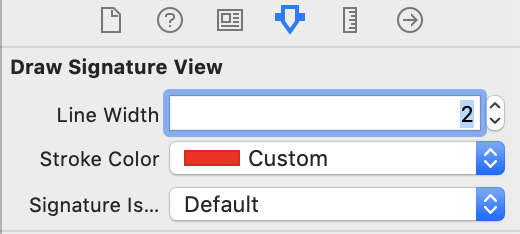
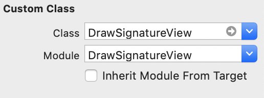

# DrawSignatureView
DrawSignatureView is a simple, light-weight drawing framework written in Swift. Its very easy to implement. 


# DrawSignatureView

Signature component for iOS written in Swift

[](http://cocoapods.org/pods/DrawSignatureView)
[](https://developer.apple.com/swift/)
[](https://cocoapods.org/?q=DrawSignatureView)

## Requirements
* iOS 9.0+
* Swift 5.0

### Installation

##### [CocoaPods](http://cocoapods.org)

DrawSignatureView is available through CocoaPods. To install it, simply add the following line to your Podfile:
```ruby
pod "DrawSignatureView"
```

## Usage

Using DrawSignatureView is very simple:

### Getting Started:

If you have installed via Cocoapods, you will need to import the module into your Swift file:

    import DrawSignatureView

Create a DrawSignatureView through code:

    let drawSignatureView = DrawSignatureView(frame: frame)
    self.view.addSubview(drawSignatureView)

Create a DrawSignatureView interface builder:

  
  

#### Methods

Clears signature

      self.drawSignatureView.erase()

#### Callbacks
  
  * Signature State by Callback
  
         self.drawSignatureView.currentTouchState = { [weak self] (touchState) in
           switch touchState {
           case .began:
             print("began")
           case .moved:
             print("moved")
           case .ended:
             print("ended")
           case .none:
             print("none")
           }
         }

*  Capture Siganture by Callback
    
        self.drawSignatureView.captureSignature { [weak self] (signature) in
          if let signature = signature {
            print("Capture Signature: \(signature.image)")
            print("Capture time: \(signature.date)")
            self?.captureSignatureImageView.image = signature.image
          }
        }

#### Example Code

```
import DrawSignatureView

class ViewController: UIViewController {

@IBOutlet weak private var drawSignatureView: DrawSignatureView!
@IBOutlet weak private var captureSignatureImageView: UIImageView!

override func viewDidLoad() {
super.viewDidLoad()
// Do any additional setup after loading the view.

self.signatureState()
}

/// Signature State by CallBack
private func signatureState() {
self.drawSignatureView.currentTouchState = { [weak self] (touchState) in
switch touchState {
case .began:
print("began")
case .moved:
print("moved")
case .ended:
print("ended")
case .none:
print("none")
}
}
}

/// Clear Signature
@IBAction func clearSignature(_ sender: UIButton) {

self.captureSignatureImageView.image = nil
self.drawSignatureView.erase()
}

/// Capture Siganture
@IBAction func captureSignature(_ sender: UIButton) {

self.drawSignatureView.captureSignature { [weak self] (signature) in
if let signature = signature {
print("Capture Signature: \(signature.image)")
print("Capture time: \(signature.date)")
self?.captureSignatureImageView.image = signature.image
}
}
}
}   


```

